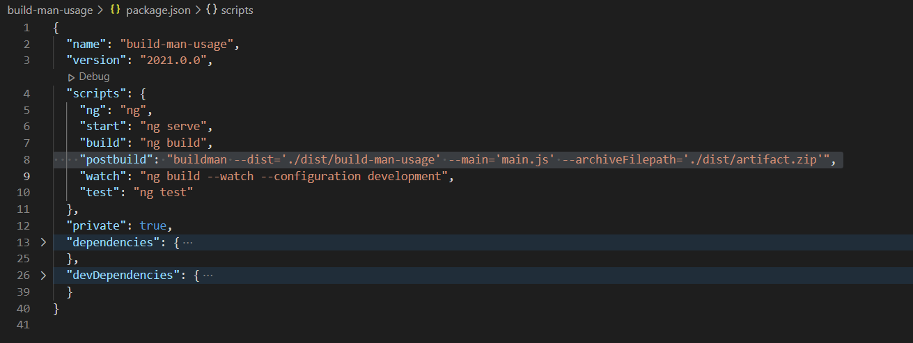

# build-man

## Why ?
I was working on an enterprise application which had deployments every week, it became very difficult to track the changes that got deployed. Well then I created an inhouse small nodejs package which had the ability to help me overcome this tedious activities of incorporating a version assossiation with a build, compress the build files to a single artifact and get that ready to be deployed to a artifactory like jfrog with just a single npm command. With this package I intend to provide a solution for those who require to associate a build version to their application so that it can be noticed inside the console log, also compress the build files to a zip file so as to upload to a artifactory.

## Installation

```
npm install build-man
```

## How is version generated

There are two ways to provide the app version to the package. The first part of the app version will be taken from your package json file reading the ```version``` provided in it. There is option to provide build no. which could have generated else where and also generate a unique build number. The build no. will suffixed to the app version provided in the package.json file.

## Usage

This package should be used as a post build script after the build is generated. Currently there are two utilities that this package offers:

1. Associate version to a build
2. Zip the build files to create a single artifact file

```
buildman --dist='%distribution folder%' --main='%main file - landing script%' --archiveFilepath='%path to which artifact needs to be created inclusing the <filename>.zip%'
```

Lets look at each arguments:

```--dist :``` Provide your distribution folder in which the build will be generated. This property is required!

```--main :``` Provide your main landing script file upon which the build version needs to be transposed. If the main file is generated with a dynamic name suffix, you can specify a pattern(like main*.js for main.sdsdaasdsad.js or mainasdadasd.js). This property is required!

```--archiveFilepath :``` Provide the path to which the artifact needs to be created ending with the <filename>.zip . This property is optional if you want to zip the build files to a single artifact

```--build_no :``` Provide the build no which needs to be associated to the build. This property is optional

An example of the usage is as below:



The command ```buildman``` should be available to be used after the installation.
```
buildman --dist='./dist/build-man-usage' --main='main.js' --archiveFilepath='./dist/artifact.zip'
```

## TODO

* Based on your sugestions!

## License

### MIT

